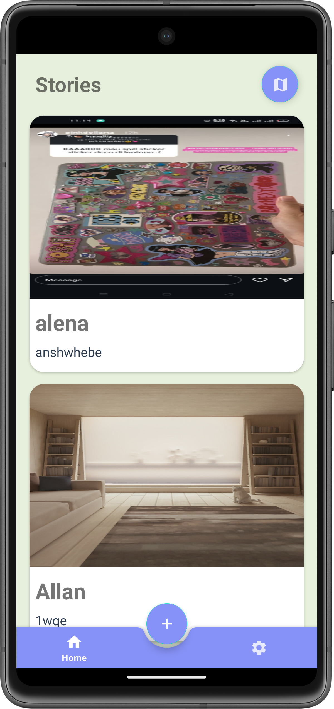

## Stories - Sharing Story application
Stories is an application that built by Kotlin Programming Language and Android Studio to be a place to share your story. 

- ### Features
  - #### Sign In and Sign Up
  - #### Add New Story : Allowed user to post their story easily with photo and location (optional)
  - #### Google Maps : Integrated maps with user's story (limited only for Story that provided location)
  - #### Language Options : Allowed user to change language of the application (limited only for English and Indonesian)
 
- ### Technologies Used
  - #### MVVM (Model-View-ViewModel) architecture pattern
  - #### Kotlin Coroutines -> Asynchronous Process
  - #### Retrofit -> Data Networking
  - #### Paging 3 -> Data loading and pagination
  - #### Datastore -> Stored user's data preferences
  - #### RemoteMediator -> Stored user's data Locally and get updated when application goes online
 
- ### How to get Started
  - #### Visit and [get your own Maps API Key](https://console.cloud.google.com/apis/enableflow?apiid=maps-android-backend.googleapis.com&keyType=CLIENT_SIDE_ANDROID&project=charming-shield-422908-v1)
  - #### Go to API and Services > Credentials > Create Credentials > Api Key
  - #### Clone stories-app repository
    ````
    https://github.com/fidelcavell/stories-app.git
    ````
  - #### Add your own Maps API Key to `  local.properties  `
    ````
    MAPS_API_KEY=YOUR_API_KEY
    ````
    
- ### Preview
    
     
     
